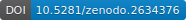

# [Reactome](https://reactome.org/), Python, and Neo4j
[](https://doi.org/10.5281/zenodo.2634377)
[](https://www.gnu.org/licenses/gpl-3.0)
[](https://pypi.python.org/pypi/ReactomePy)
[](https://anaconda.org/dvklopfenstein/reactomepy)
[](https://anaconda.org/dvklopfenstein/reactomepy)
[](https://anaconda.org/dvklopfenstein/reactomepy)
[](https://conda.anaconda.org/dvklopfenstein)

Explore biomolecular pathways in Reactome from the command-line or a Python script.    

In addition to biomolecular pathways,
Reactome contains 
expert-authored and peer-reviewed
reactions, 
molecular complex ingredients and structure, and
protein-protein interactions.

Reactome also provides links from pathways, reactions, and molecules to 
biological models, associated research papers, URLs, and books.


## Use this Python3 library to:

  1) Run [**Reactome's Neo4j Tutorial**](https://reactome.org/dev/graph-database/extract-participating-molecules)
     from one of the [**Jupyter notebooks**](/src/ipy/tutorial/README.md)
     or a plain [**Python script**](/src/bin_neo4j/tutorial)

  2) Find enriched pathways
     [**from the command line**](/doc/md/README_analyses.md),
     accessing Reactome's online
     [**Pathway Analysis Service**](https://reactome.org/AnalysisService/) 

  3) Write your own Python scripts accessing the Reactome database through Neo4j


## Links
  * **Official Reactome Help**:
    * [**Reactome Documentation**](https://reactome.org/dev/graph-database)    
    * Support: **help@reactome.org**
  * **User's Download hints**
    * [1) Install Neo4j](/doc/md/README_install_neo4j.md)    
    * [2) Download Reactome Knowledgebase](/doc/md/README_download_hints.md)   
  * **Reactome Publications**
    * 2018 | [Reactome graph database: Efficient access to complex pathway data](https://journals.plos.org/ploscompbiol/article?rev=2&id=10.1371/journal.pcbi.1005968)
  * **Reactome Documentation**    
    * [Data Schema](https://reactome.org/content/schema/DatabaseObject)    
    * [Glossary Data Model](http://wiki.reactome.org/index.php/Glossary_Data_Model)    
    * [Icon library](https://reactome.org/icon-lib)    
    * [Reactome Graph Database on GitHub](https://github.com/reactome/graph-core)    

  * We use the **Neo4j Python driver** that is [officially supported](https://neo4j.com/developer/python) by Neo4j
    * https://github.com/neo4j/neo4j-python-driver

## To Cite

_Please cite if this repo is used in your research_:

Klopfenstein DV, Dampier W [_ReactomePy_](https://doi.org/10.5281/zenodo.2634376)
_Zenodo_ | (2019) | DOI: 10.5281/zenodo.2634376

### BibLaTeX citation

```
@online{klopfenstein2019reactomepy,
  author = {Klopfenstein, DV and 
            Dampier, W},
  title = {ReactomePy},
  year = 2019,
  month = apr,
  url = {https://github.com/dvklopfenstein/ReactomePy},
  doi = {10.5281/zenodo.2634376},
}
```

Copyright (C) 2018-2019, DV Klopfenstein. All rights reserved.
