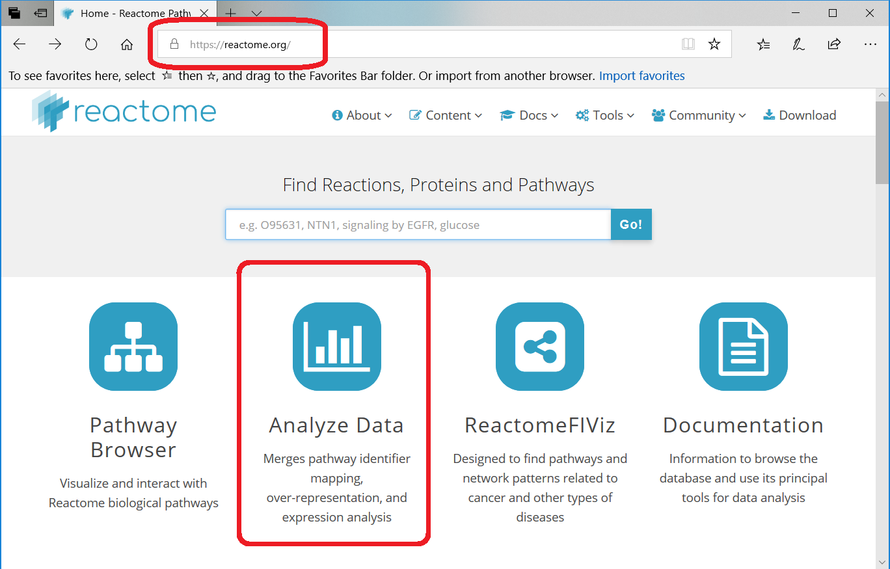
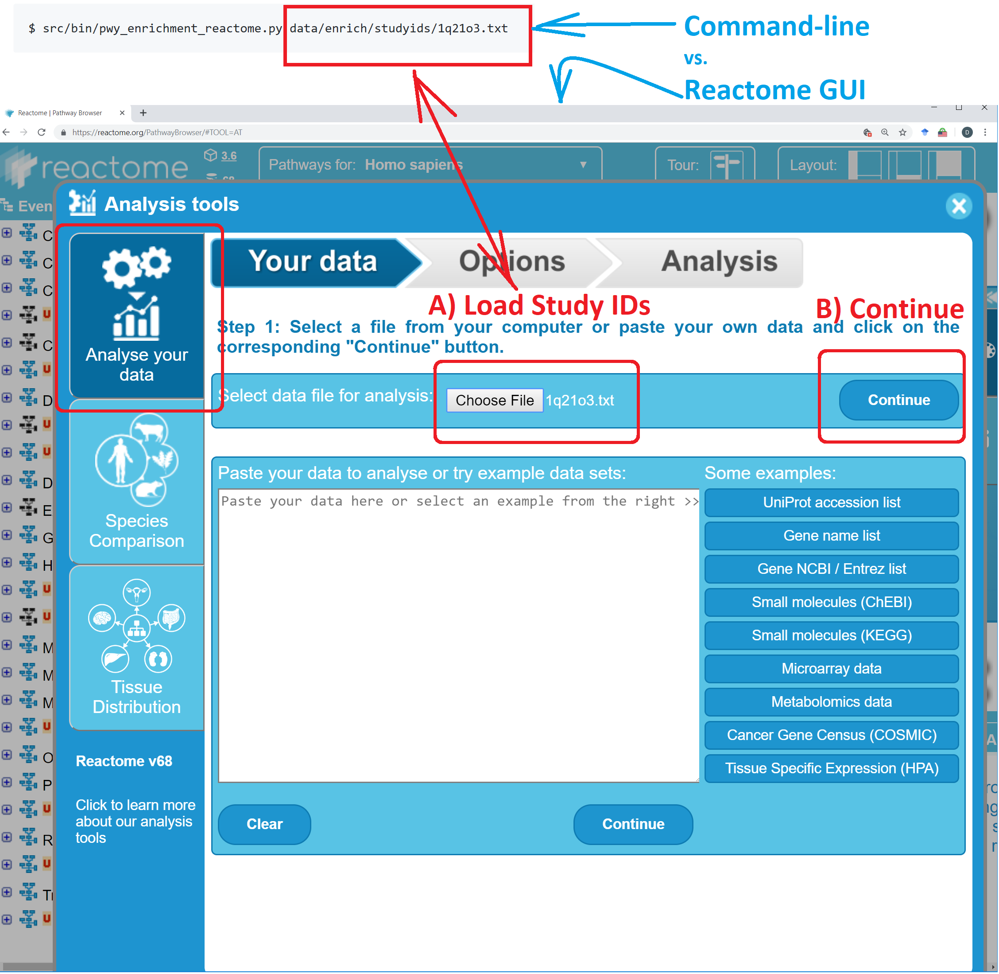

# Analyze Data with 
Get the [**same analysis results**](#command-line-and-gui-return-the-same-results)
from the command line as from Reactome's _Analyse Data Tool GUI_.

The results are written into these files:
  * result.csv
  * mapping.csv
  * result.pdf
  * not_found.csv

## Command-line Examples
```
$ src/bin/pwy_enrichment_reactome.py data/enrich/studyids/1q21o3.txt
```

## Command-line and GUI return the same results

  1. [**Reactome Pathway Analysis**](#1-reactome-pathway-analysis)
  2. [**Load Study IDs**](#2-load-study-ids)

### 1) Reactome Pathway Analysis


### 2) Load Study IDs



Copyright (C) 2018-2019, DV Klopfenstein. All rights reserved.
