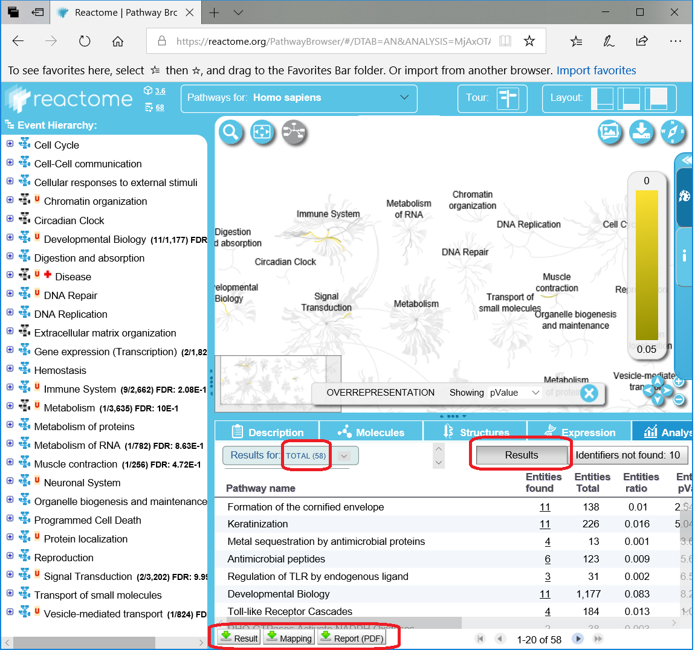
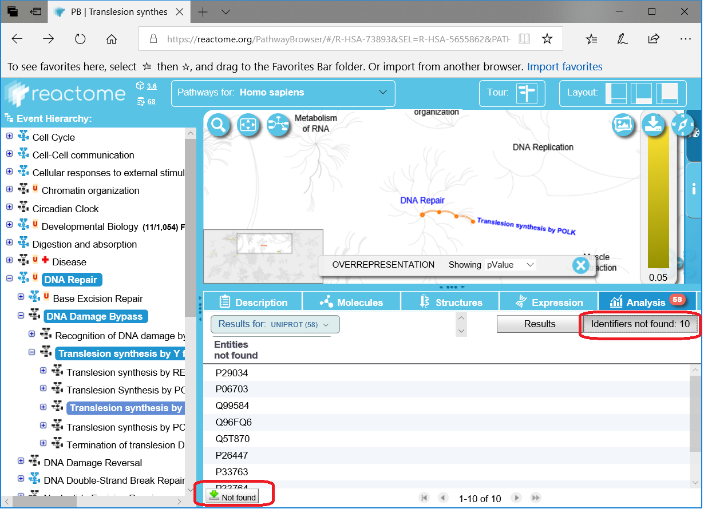

# Analyze Data with 
Get analysis results
from the [**command line**](#command-line-examples)
like those from Reactome's [**Analyse Data Tool GUI**](https://reactome.org/PathwayBrowser/#TOOL=AT).

## Table of Contents
  * [Output files](#output-files)
  * [Command-line Examples](#command-line-examples)
  * [Command-line and Reactome GUI compared](#command-line-and-reactome-gui-compared)

## Output Files

The pathway enrichment results are written into these files:

| Reactome Name | ReactomePy Name
|---------------|-----------------
| result.csv    | pathway_enrichment.csv
| result.pdf    | pathway_enrichment.pdf
| mapping.csv   | ids_mapping.csv
| not_found.csv | ids_notfound.csv

## Command-line Examples
```
$ src/bin/pwy_enrichment_reactome.py data/enrich/studyids/1q21o3.txt
```

## Command-line and Reactome GUI compared

  1. [**Reactome Pathway Analysis**](#1-reactome-pathway-analysis)
  2. [**Load Study IDs**](#2-load-study-ids)
  3. [**Write results to files**](#3-write-results-to-files)

### 1) Reactome Pathway Analysis
Click on **Analyze Data** on [**Reactome's homepage**](https://reactome.org) to begin a pathway enrichment analysis.


### 2) Load Study IDs
Load the study ID file
from the [**command line**](#command-line-examples)
or in Reactome's [**Analyse Data Tool GUI**](https://reactome.org/PathwayBrowser/#TOOL=AT).


### 3) Write results to files

| Reactome Button | Reactome Name | ReactomePy Name
|-----------------|---------------|-----------------
| Result          | result.csv    | pathway_enrichment.csv
| Report (PDF)    | result.pdf    | pathway_enrichment.pdf
| Mapping         | mapping.csv   | ids_mapping.csv
| Not found       | not_found.csv | ids_notfound.csv

#### 3a) Result and Mapping files
    

#### 3b) 'Not found' file
      


Copyright (C) 2018-2019, DV Klopfenstein. All rights reserved.
