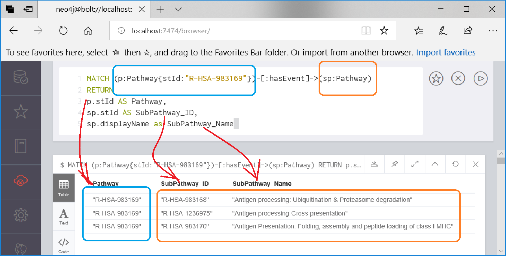

# Try a Cypher Command
**What sub-pathways are under under pathway, R-HSA-983169, _Class I MHC mediated antigen processing & presentation_?**

Copyright (C) 2018-2019, DV Klopfenstein. All rights reserved.
