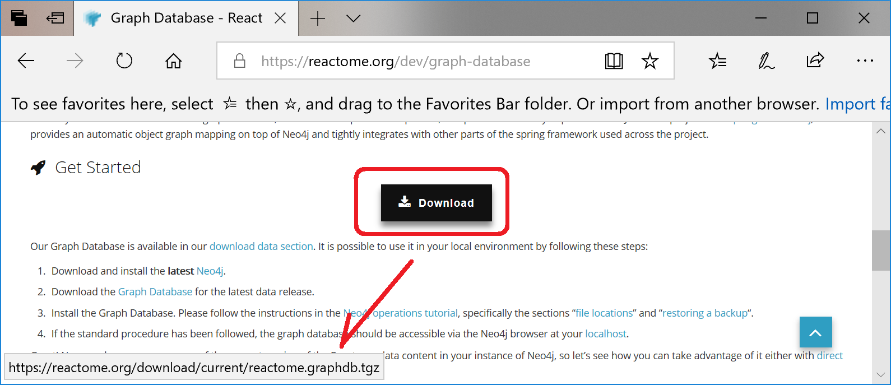
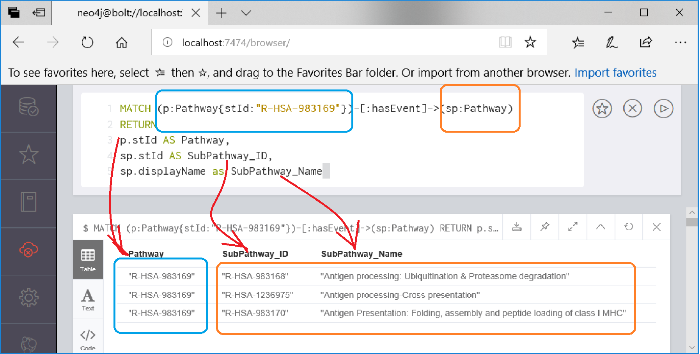

# Reactome Download Hints
Please see [**Reactome's official documentation**](https://reactome.org/dev/graph-database#GetStarted)
regarding downloading the Reactome Knowledgebase.

**Please direct questions** regarding **loading the Reactome Knowledgebase** to **Reactome**,
rather than open an issue in this repo.


## Hints for downloading the Reactome Knowledgebase
1. [**Download the Reactome database**](#1-download-the-reactome-database)
2. [**Uncompress and extract the database**](#2-uncompress-and-extract-the-reactome-database-in-neo4j-format)
3. [**Ensure the graph.db directory does not exist in the Neo4j directory structure**](#3-ensure-the-graphdb-directory-does-not-exist-in-the-neo4j-directory-structure)
4. [**Moved the Reactome database to the Neo4j graph.db directory**](#4-moved-the-reactome-database-to-the-graphdb-directory)
5. [**Start the neo4j server on the new Reactome Knowledgebase**](#5-start-the-neo4j-server-on-the-new-reactome-knowledgebase)
6. [**View the Reactome database in the neo4j browser**]()
7. [**Python interface to neo4j**](README_gdbdr.md):    
  7.1) [**Install the Python package, neo4j**](README_gdbdr.md##1-install-the-python-package-neo4j)    
  7.2) [**Connect to the neo4j server from a Python script**](README_gdbdr.md#2-connect-to-the-neo4j-server-from-a-python-script)    


## Hints for downloading the Reactome Knowledgebase (details)
### 1. Download the Reactome database


### 2. Uncompress and extract the Reactome database in Neo4j format
```
$ tar -xzvf reactome.graphdb.tgz
    reactome.graphdb.v67/
    reactome.graphdb.v67/neostore.labeltokenstore.db.names.id
    reactome.graphdb.v67/neostore.nodestore.db.id
    reactome.graphdb.v67/neostore.propertystore.db.index.id
    reactome.graphdb.v67/neostore.relationshipstore.db.id
    reactome.graphdb.v67/neostore.counts.db.a
    reactome.graphdb.v67/neostore.propertystore.db.strings
    ...
```

### 3. Ensure the graph.db directory does not exist in the Neo4j directory structure

Does the graph.db directory exist?    
No? Go to step 4.    
```
$ cd ~/neo4j/neo4j-community-3.4.7/data/databases/graph.db
$ ls graph.db
    ls: cannot access 'graph.db': No such file or directory
```

Yes? Move it out of the way:
```
$ ls graph.db
    debug.log                             neostore.nodestore.db.labels             neostore.relationshipgroupstore.db.id
    index                                 neostore.nodestore.db.labels.id          neostore.relationshipstore.db
    neostore                              neostore.propertystore.db                neostore.relationshipstore.db.id
    ...
$ mv graph.db graph.db.v66
$ ls graph.db
    ls: cannot access 'graph.db': No such file or directory
```

### 4. Moved the Reactome database to the graph.db directory
```
$ mv reactome.graphdb.v67 ~/neo4j/neo4j-community-3.4.7/data/databases/graph.db

# Confirm it is moved
$ cd ~/neo4j/neo4j-community-3.4.7/data/databases/graph.db
$ ls graph.db
    debug.log                             neostore.nodestore.db.labels             neostore.relationshipgroupstore.db.id
    index                                 neostore.nodestore.db.labels.id          neostore.relationshipstore.db
    neostore                              neostore.propertystore.db                neostore.relationshipstore.db.id
    ...
```

### 5. Start the neo4j server on the new Reactome Knowledgebase
```
$ neo4j/neo4j-community-3.4.7/bin/neo4j start
    Active database: graph.db
    Directories in use:
      home:         /home/neo4j/neo4j/neo4j-community-3.4.7
      config:       /home/neo4j/neo4j/neo4j-community-3.4.7/conf/
      logs:         /home/neo4j/neo4j/neo4j-community-3.4.7/logs
      plugins:      /home/neo4j/neo4j/neo4j-community-3.4.7/plugins
      import:       /home/neo4j/neo4j/neo4j-community-3.4.7/import
      data:         /home/neo4j/neo4j/neo4j-community-3.4.7/data
      certificates: /home/neo4j/neo4j/neo4j-community-3.4.7/certificates
      run:          /home/neo4j/neo4j/neo4j-community-3.4.7/run
    Starting Neo4j.
    WARNING: Max 1024 open files allowed, minimum of 40000 recommended. See the Neo4j manual.
    Started neo4j (pid 545). It is available at http://localhost:7474/
    There may be a short delay until the server is ready.
    See /home/neo4j/neo4j/neo4j-community-3.4.7/logs/neo4j.log for current status.
```
### 6. View the Reactome database in the neo4j browser
#### Try a Cypher command:
What sub-pathways are under under pathway, R-HSA-983169, _Class I MHC mediated antigen processing & presentation_?



### 7. [**Python interface to neo4j**](README_gdbdr.md)    
More on the [next page...](README_gdbdr.md)    

Copyright (C) 2018-2019, DV Klopfenstein. All rights reserved.
