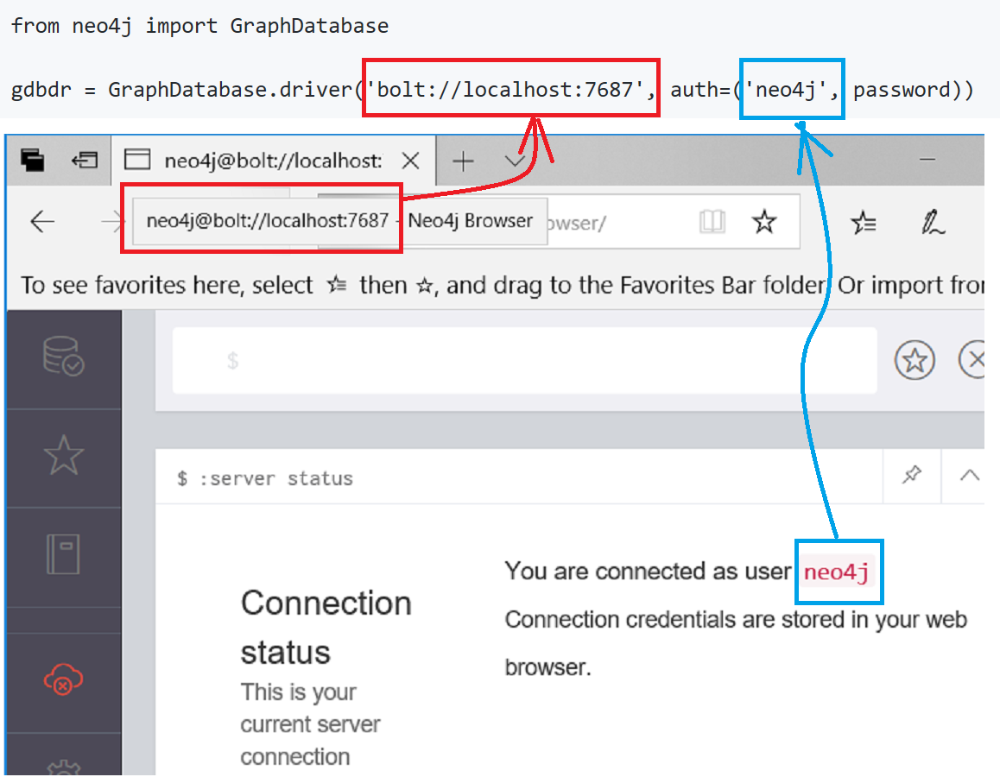
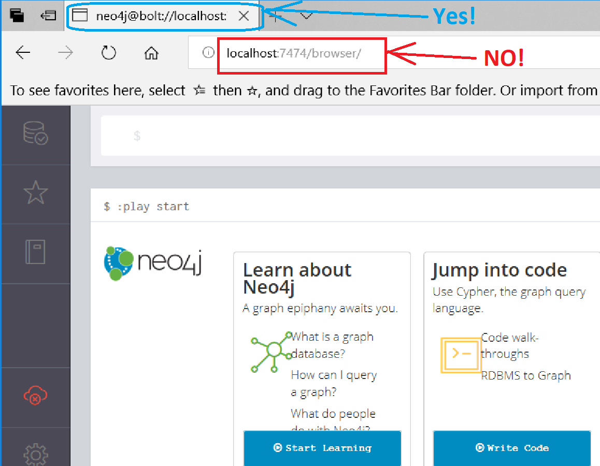

# How to Connect Neo4j in Python

1) [**Install the Python package, neo4j**](#1-install-the-python-package-neo4j)
2) [**Connect to the neo4j server from a Python script**](#2-connect-to-the-neo4j-server-from-a-python-script)
3) [**Three Arguments:**](#three-arguments-graphdatabasedriverurl-authusername-password)
**GraphDatabase.driver([_url_](#1-url-hover-your-mouse-over-the-tab-to-see-it--not-the-url-seen-in-the-browser-command-line),
auth=([_username_](#2-username-neo4j-username-seen-with-the-neo4j-command), [_password_](#3-password-can-be-set-in-neo4j-using)))**

## 1) Install the Python package, neo4j
```
pip install neo4j
```

## 2) Connect to the neo4j server from a Python script
```
from neo4j import GraphDatabase

gdbdr = GraphDatabase.driver('bolt://localhost:7687', auth=('neo4j', password))
```

### Three Arguments: GraphDatabase.driver(_url_, auth=(_username_, _password_))
#### 1. _url_: Hover the mouse over the tab to see it.  [NOT the url seen in the browser command-line](#do-not-use-the-url-seen-in-the-command-line).   
#### 2. _username_: Neo4j username seen with the neo4j command:    
```
:server status
```
#### 3. _password_: can be set in Neo4j using:   
```
:server change-password
```
### Use the URL seen when hovering over the tab


### Do not use the URL seen in the command line


Copyright (C) 2018-present, DV Klopfenstein. All rights reserved.
